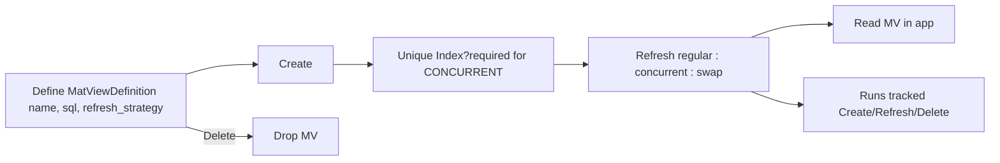

# rails_materialized_views (mat_views)

[](https://rubygems.org/gems/mat_views)
[](https://github.com/your-org/rails_materialized_views/actions)


> A Rails engine to define, create, refresh, and delete **PostgreSQL materialized views** with clean APIs, background jobs, observability, and CLI tasks. Built for **high availability** and **repeatable ops**.

- 📦 Engine/gem: [`mat_views/`](./mat_views)
- 🧪 Demo app: [`mat_views_demo/`](./mat_views_demo) *(not shipped with the gem)*

---

## Quickstart (diagram)



---

## ⚡ Why materialized views? Real numbers

On a \~50k-row dataset, reading from pre-aggregated materialized views turns heavy joins into **double-digit to triple-digit speedups** compared to running the raw SQL each time.

#### Sample run (5 iterations)

| view                       | iterations | baseline\_avg\_ms | baseline\_min\_ms | baseline\_max\_ms | mv\_avg\_ms | mv\_min\_ms | mv\_max\_ms | speedup\_avg | rows\_baseline | rows\_mv |
| -------------------------- | ---------: | ----------------: | ----------------: | ----------------: | ----------: | ----------: | ----------: | -----------: | -------------: | -------: |
| mv\_user\_accounts         |          5 |                31 |                16 |                74 |           2 |           1 |           5 |         15.5 |          50000 |    50000 |
| mv\_user\_accounts\_events |          5 |                78 |                70 |               108 |           1 |           1 |           2 |         78.0 |          50000 |    50000 |
| mv\_user\_activity         |          5 |               161 |               159 |               165 |           1 |           1 |           2 |        161.0 |          50000 |    50000 |
| mv\_users                  |          5 |                 1 |                 1 |                 2 |           2 |           1 |           7 |          0.5 |          50000 |    50000 |

#### Stability check (100 iterations)

| view                       | iterations | baseline\_avg\_ms | baseline\_min\_ms | baseline\_max\_ms | mv\_avg\_ms | mv\_min\_ms | mv\_max\_ms | speedup\_avg | rows\_baseline | rows\_mv |
| -------------------------- | ---------: | ----------------: | ----------------: | ----------------: | ----------: | ----------: | ----------: | -----------: | -------------: | -------: |
| mv\_user\_accounts         |        100 |                17 |                15 |                69 |           1 |           1 |          20 |         17.0 |          50000 |    50000 |
| mv\_user\_accounts\_events |        100 |                70 |                70 |                73 |           1 |           1 |           3 |         70.0 |          50000 |    50000 |
| mv\_user\_activity         |        100 |               161 |               158 |               242 |           1 |           1 |           2 |        161.0 |          50000 |    50000 |
| mv\_users                  |        100 |                 1 |                 1 |                 1 |           1 |           1 |           2 |          1.0 |          50000 |    50000 |

**Takeaways**

* Multi-table aggregates shine: **\~70×** (accounts+events), **\~161×** (full activity).
* Single-table scans: little/no benefit; use normal indexes or caching.
* Materialize **expensive joins/aggregations** you read often.

---

## Features

* **DB definitions**: SQL, strategy, unique index columns, dependencies
* **Create / Refresh / Delete** services & jobs (uniform responses)
* **Refresh strategies**: `regular`, `concurrent` (needs unique index), `swap`
* **CLI**: Rake tasks for create/refresh/delete by name, id, or all (with confirm)
* **Observability**: run tracking tables for create/refresh/delete
* **Rails-native**: Active Job, `Rails.logger`, clear error reporting

---

## Install (engine)

```ruby
# Gemfile
gem 'mat_views'
```

```bash
bundle install
bin/rails g mat_views:install
bin/rails db:migrate
```

Init:

```ruby
# config/initializers/mat_views.rb
MatViews.configure do |c|
  c.job_queue = :default # default queue for background jobs
  c.job_adapter = :active_job # (default), :sidekiq, :resque

  # c.retry_on_failure = true  # retry refresh if it fails, currently it has no effect, it will be implemented in future
end
```

---

## Job adapter (enqueue)

All enqueues go through the adapter — it **does not guess** backends; it uses what **you** configured:

```ruby
MatViews::Jobs::Adapter.enqueue(
  MatViews::RefreshViewJob,
  queue: MatViews.configuration.job_queue,
  args:  [definition_id, :estimated]
)
```

* Supported backends: **ActiveJob**, **Sidekiq**, **Resque** (more welcome).
* Configure your backend as usual; the adapter delegates accordingly.

---

## CLI (Rake tasks)

```bash
# Create
bundle exec rake mat_views:create_by_name\[VIEW_NAME,force,--yes]
bundle exec rake mat_views:create_by_id\[ID,force,--yes]
bundle exec rake mat_views:create_all\[force,--yes]

# Refresh
bundle exec rake mat_views:refresh_by_name\[VIEW_NAME,row_count_strategy,--yes]
bundle exec rake mat_views:refresh_by_id\[ID,row_count_strategy,--yes]
bundle exec rake mat_views:refresh_all\[row_count_strategy,--yes]

# Delete
bundle exec rake mat_views:delete_by_name\[VIEW_NAME,cascade,--yes]
bundle exec rake mat_views:delete_by_id\[ID,cascade,--yes]
bundle exec rake mat_views:delete_all\[cascade,--yes]
```

---

## Demo app

See [`mat_views_demo/`](./mat_views_demo) for seeds, MV definitions, and reproducible benchmarks (not shipped with the gem).

---

## Contributing, Security, Conduct

* **Contributing:** see [CONTRIBUTING.md](./CONTRIBUTING.md)
* **Security policy:** see [SECURITY.md](./SECURITY.md)
* **Code of Conduct:** see [CODE\_OF\_CONDUCT.md](./CODE_OF_CONDUCT.md)

---

## License

MIT © Codevedas Inc.