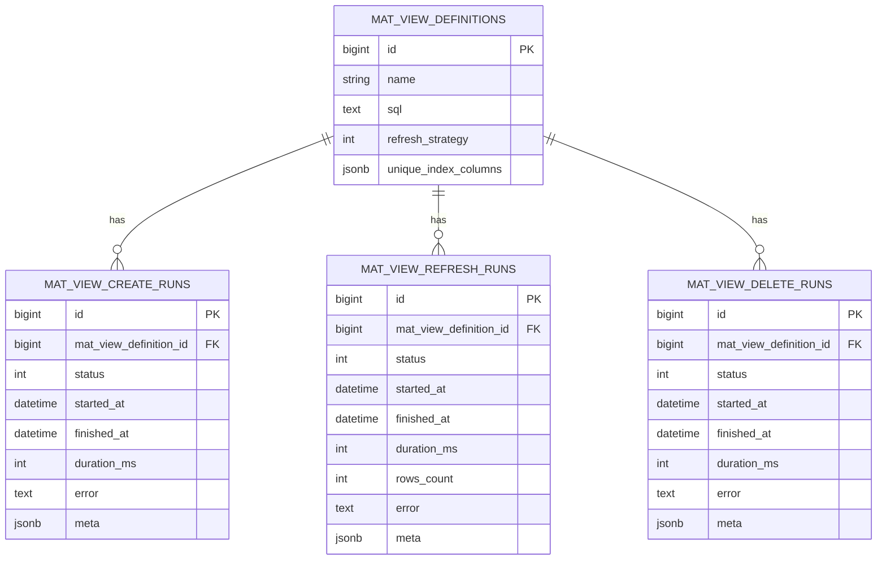

# Run Tracking (Create / Refresh / Delete)

Every materialized-view operation is recorded in a dedicated table so you can **audit**, **debug**, and **measure** performance over time.

* **Create runs:** `mat_view_create_runs` → `MatViews::MatViewCreateRun`
* **Refresh runs:** `mat_view_refresh_runs` → `MatViews::MatViewRefreshRun`
* **Delete runs:** `mat_view_delete_runs` → `MatViews::MatViewDeleteRun`

These rows are created and finalized by the corresponding **ActiveJob** wrappers:

* `MatViews::CreateViewJob`
* `MatViews::RefreshViewJob`
* `MatViews::DeleteViewJob`

{: .note}
> Jobs enqueue via the adapter:
> `MatViews::Jobs::Adapter.enqueue(job_class, queue: MatViews.configuration.job_queue, args: [...])`
> The adapter uses your configured backend (ActiveJob / Sidekiq / Resque) and does **not** guess.

---

## Status lifecycle

All run models share the same `status` enum:

* `pending` (0) — reserved; rarely used directly by jobs
* `running` (1) — job started, clock started
* `success` (2) — operation completed successfully
* `failed`  (3) — operation failed; `error` contains details

Jobs set `started_at` / `finished_at` and compute `duration_ms` using a monotonic clock.

---

## Schema

Below are the essential columns for each run table.

### Create runs

| Column                     | Type      | Notes                             |
| -------------------------- | --------- | --------------------------------- |
| `mat_view_definition_id`   | bigint FK | Required                          |
| `status`                   | integer   | `pending/running/success/failed`  |
| `started_at`               | datetime  | Job start time                    |
| `finished_at`              | datetime  | Job end time                      |
| `duration_ms`              | integer   | Milliseconds (monotonic)          |
| `error`                    | text      | Error message when failed         |
| `meta`                     | jsonb     | Free-form: service payload/params |
| `created_at`, `updated_at` | datetime  | Timestamps                        |

Index: `index_mat_view_create_runs_on_mat_view_definition_id`

### Refresh runs

| Column                     | Type      | Notes                                                                 |
| -------------------------- | --------- | --------------------------------------------------------------------- |
| `mat_view_definition_id`   | bigint FK | Required                                                              |
| `status`                   | integer   | `pending/running/success/failed`                                      |
| `started_at`               | datetime  | Job start time                                                        |
| `finished_at`              | datetime  | Job end time                                                          |
| `duration_ms`              | integer   | Milliseconds (monotonic)                                              |
| `rows_count`               | integer   | Optional; only when row count requested                               |
| `error`                    | text      | Error message when failed                                             |
| `meta`                     | jsonb     | Includes e.g. `{"view":"public.mv","row_count_strategy":"estimated"}` |
| `created_at`, `updated_at` | datetime  | Timestamps                                                            |

Index: `index_mat_view_refresh_runs_on_mat_view_definition_id`

### Delete runs

| Column                     | Type      | Notes                                                        |
| -------------------------- | --------- | ------------------------------------------------------------ |
| `mat_view_definition_id`   | bigint FK | Required                                                     |
| `status`                   | integer   | `pending/running/success/failed`                             |
| `started_at`               | datetime  | Job start time                                               |
| `finished_at`              | datetime  | Job end time                                                 |
| `duration_ms`              | integer   | Milliseconds (monotonic)                                     |
| `error`                    | text      | Error message when failed                                    |
| `meta`                     | jsonb     | E.g. `{"cascade":false,"if_exists":true,"view":"public.mv"}` |
| `created_at`, `updated_at` | datetime  | Timestamps                                                   |

Index: `index_mat_view_delete_runs_on_mat_view_definition_id`

---

## Relationships (diagram)



---

## How runs are written

Each job follows the same high-level flow:

1. Insert a run row with `status: :running` and `started_at`.
2. Call the appropriate **service** (`CreateView`, `Regular/Concurrent/SwapRefresh`, `DeleteView`).
3. Finalize the run:

   * on success: `status: :success`, set `finished_at`, `duration_ms`, `meta` from service response.
   * on error: `status: :failed`, set `error`, `finished_at`, `duration_ms`, `meta` from response.

{: .note}
> Services return a uniform `MatViews::ServiceResponse` that includes `status`, `payload` (e.g., `view`), and `meta` (e.g., `sql`, strategies, options). Jobs persist the **payload/meta** into the run row’s `meta`.

---

## Reading runs (Rails)

```ruby
# Latest refresh run for a view
defn = MatViews::MatViewDefinition.find_by!(name: "mv_user_activity")
last_run = MatViews::MatViewRefreshRun
  .where(mat_view_definition_id: defn.id)
  .order(created_at: :desc)
  .first

if last_run&.status_success?
  puts "Last refresh OK in #{last_run.duration_ms} ms, rows=#{last_run.rows_count}"
else
  puts "Last refresh failed: #{last_run&.error}"
end
```

```ruby
# Last N runs (any type), newest first
runs = MatViews::MatViewRefreshRun
         .where(mat_view_definition_id: defn.id)
         .order(created_at: :desc)
         .limit(20)
```

---

## Aggregating metrics

A few handy snippets to power dashboards or reports:

### Refresh duration stats (per view)

```ruby
MatViews::MatViewRefreshRun
  .joins(:mat_view_definition)
  .where(status: :success)
  .group("mat_view_definitions.name")
  .pluck(
    "mat_view_definitions.name",
    "AVG(duration_ms)::int",
    "MIN(duration_ms)",
    "MAX(duration_ms)",
    "COUNT(*)"
  )
# => [["mv_user_activity", 123, 95, 181, 42], ...]
```

### Failure counts (last 24h)

```ruby
MatViews::MatViewRefreshRun
  .where(status: :failed)
  .where("created_at >= ?", 24.hours.ago)
  .group(:mat_view_definition_id)
  .count
```

### Latest rows\_count (if tracked)

```ruby
MatViews::MatViewRefreshRun
  .select("DISTINCT ON (mat_view_definition_id) mat_view_definition_id, rows_count, created_at")
  .where(status: :success)
  .order("mat_view_definition_id, created_at DESC")
```

---

## Dashboards & alerts

* **Dashboards:** chart `duration_ms` over time per view; show last status & rows\_count.
* **SLOs:** alert on `failed` refreshes, or on unusually high `duration_ms` (e.g., 2× moving average).
* **Freshness:** display `last_refreshed_at` (if you maintain it on the definition) or derive it from the latest successful refresh run’s `finished_at`.

---

## Retention & pruning

Run tables can grow quickly. Consider a periodic cleanup:

* Keep last **N** runs per view (e.g., 500)
* Or keep last **X days** of history (e.g., 90d)

Example (Postgres SQL):

```sql
-- Keep last 500 successful runs per view; keep all failures
WITH ranked AS (
  SELECT id, mat_view_definition_id,
         ROW_NUMBER() OVER (PARTITION BY mat_view_definition_id, status ORDER BY created_at DESC) AS rn
  FROM mat_view_refresh_runs
  WHERE status = 2 -- success
)
DELETE FROM mat_view_refresh_runs
USING ranked
WHERE mat_view_refresh_runs.id = ranked.id
  AND ranked.rn > 500;
```

{: .note}
> Tune by environment (prod vs. staging) and your storage/observability needs.

---

## Troubleshooting

* **Run shows `success` but MV seems unchanged**
  Confirm which **refresh strategy** ran (see `defn.refresh_strategy` and the run’s `meta`). For `:estimated` counts, remember `reltuples` is approximate; use `:exact` to verify.

* **No runs recorded**
  Ensure you’re enqueuing the **job** (not just calling services directly) if you want persistence. Services themselves don’t write run rows.

* **Long durations out of nowhere**
  Check for locks/long transactions, autovacuum interference, or compute spikes. Correlate `duration_ms` with DB logs and `pg_stat_activity`.

---

## See also

* [Definitions)](./definitions)
* [Creation, Refresh & Delete Services](./services)
* [Jobs & Adapter](./jobs-and-adapters)
* [Rake Tasks](./rake-tasks)
* [Validation & Benchmarks](/validation)
* Project policies: [SECURITY](https://github.com/Code-Vedas/rails_materialized_views/blob/main/SECURITY.md) · [CONTRIBUTING](https://github.com/Code-Vedas/rails_materialized_views/blob/main/CONTRIBUTING.md) · [CODE\_OF\_CONDUCT](https://github.com/Code-Vedas/rails_materialized_views/blob/main/CODE_OF_CONDUCT.md)

