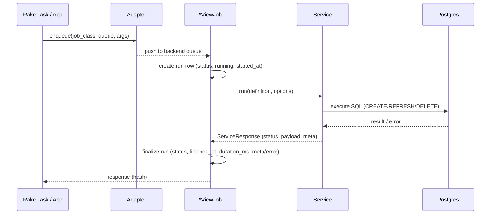

# Jobs & Adapter

Jobs are the **asynchronous** wrappers around the services.
They normalize inputs, time the operation, persist a **run record**, and return a concise hash for programmatic use.
The **Adapter** is a single, stable API used everywhere in this project (rake tasks, demo app, examples) to enqueue jobs — regardless of whether your app uses **ActiveJob**, **Sidekiq**, or **Resque**.

---

## TL;DR

- Enqueue with **one** call:

  ```ruby
  MatViews::Jobs::Adapter.enqueue(
    MatViews::RefreshViewJob,
    queue: MatViews.configuration.job_queue,
    args:  [definition.id, :estimated] # or :exact
  )
  ```

- The adapter **does not guess** a backend; it assumes your project’s job system is already configured.
- Jobs create/update **run table**:
  - Create → `mat_view_runs` with `operation: :create`
  - Refresh → `mat_view_runs` with `operation: :refresh`
  - Delete → `mat_view_runs` with `operation: :drop`

---

## Configuration

Set a default queue for all MatViews jobs:

```ruby
# config/initializers/mat_views.rb
MatViews.configure do |c|
  c.job_queue = :default
end
```

Make sure your app’s background job system is configured:

- **ActiveJob** (default Rails):

  ```ruby
  # e.g., config/environments/production.rb
  config.active_job.queue_adapter = :sidekiq # or :resque, :delayed_job, etc.
  ```

- **Sidekiq** / **Resque**: configure per their docs. The adapter will respect your setup.

{: .note}

> The adapter’s contract is stable: `Adapter.enqueue(job_class, queue:, args:)`. It forwards to the configured backend without trying to detect or override it.

---

## Jobs overview

Each job wraps a service, measures **duration**, and writes a run row.

### Create

**Class:** `MatViews::CreateViewJob`
**Performs:** `MatViews::Services::CreateView`
**Run table:** `mat_view_runs` with `operation: :create`

**Signature:**

```ruby
perform(definition_id, force_arg = nil)
```

**Normalization:**

- `force_arg` can be:
  - `true/false`
  - or `{ force: true/false }`
  - defaults to `false`

**Enqueue examples:**

```ruby
# via adapter (recommended for CLI/tools consistency)
MatViews::Jobs::Adapter.enqueue(
  MatViews::CreateViewJob,
  queue: MatViews.configuration.job_queue,
  args:  [defn.id, true] # force=true
)

# or directly (ActiveJob)
MatViews::CreateViewJob.perform_later(defn.id, force: true)
```

---

### Refresh

**Class:** `MatViews::RefreshViewJob`
**Performs:** strategy-specific service based on `definition.refresh_strategy`
**Run table:** `mat_view_runs` with `operation: :refresh`

**Service mapping:**

- `regular` → `MatViews::Services::RegularRefresh`
- `concurrent` → `MatViews::Services::ConcurrentRefresh` (needs a **unique index**)
- `swap` → `MatViews::Services::SwapRefresh`

**Signature:**

```ruby
perform(definition_id, strategy_arg = nil)
```

**Normalization (row count):**

- Accepts symbol/string or a hash:
  - `:estimated` (default), `:exact`, or `nil` (skip).
  - `{ row_count_strategy: :exact }` also works.

**Enqueue examples:**

```ruby
MatViews::Jobs::Adapter.enqueue(
  MatViews::RefreshViewJob,
  queue: MatViews.configuration.job_queue,
  args:  [defn.id, :exact]
)

# or directly
MatViews::RefreshViewJob.perform_later(defn.id, row_count_strategy: :estimated)
```

---

### Delete

**Class:** `MatViews::DeleteViewJob`
**Performs:** `MatViews::Services::DeleteView`
**Run table:** `mat_view_runs` with `operation: :drop`

**Signature:**

```ruby
perform(definition_id, cascade_arg = nil)
```

**Normalization (cascade boolean):**

- Accepts:
  - `true/false`
  - or `{ cascade: true/false }`
  - defaults to `false`

**Enqueue examples:**

```ruby
MatViews::Jobs::Adapter.enqueue(
  MatViews::DeleteViewJob,
  queue: MatViews.configuration.job_queue,
  args:  [defn.id, true] # cascade=true
)

# or directly
MatViews::DeleteViewJob.perform_later(defn.id, cascade: false)
```

---

## What jobs persist

Jobs record to run tables with consistent fields:

- `status`: `running | success | failed`
- `started_at`, `finished_at`, `duration_ms`
- `error` (string, when failed)
- `meta` (JSON: includes service :request, :response)
  - `request`: input args, options
  - `response`: service status, payload (e.g., view), meta (e.g SQL, strategies)
- `operation`: `create | refresh | drop`

{: .note}

> Timing uses a monotonic clock inside the job for accurate `duration_ms`.

---

## Sequence (diagram)



---

## When to use Adapter vs `perform_later`

- Use **Adapter** when:
  - You want a **single** enqueue API in CLI/tools that works across backends.
  - You want to pass a **queue name** explicitly (from `MatViews.configuration.job_queue`).

- Use **`perform_later`** when:
  - You’re already inside Rails app code using ActiveJob everywhere.
  - You don’t need the Adapter’s uniform API (still fine!).

Both paths result in identical job behavior and run tracking.

---

## Logging & errors

- Jobs don’t print to STDOUT; use `Rails.logger` for observability.
- Failures:
  - The **service** returns an error response or raises.
  - The **job** marks the run `failed` and includes the error string and any available backtrace/SQL in `meta`.

- Rake tasks (CLI) handle **confirmation**; jobs just do the work.

---

## Common patterns

### 1) Nightly refresh all (estimated rows)

```ruby
MatViews::MatViewDefinition.find_each do |defn|
  MatViews::Jobs::Adapter.enqueue(
    MatViews::RefreshViewJob,
    queue: MatViews.configuration.job_queue,
    args:  [defn.id, :estimated]
  )
end
```

### 2) Hot rebuild via swap (exact rows only for a couple of views)

```ruby
%w[mv_user_activity mv_user_accounts_events].each do |name|
  defn = MatViews::MatViewDefinition.find_by!(name: name)
  defn.update!(refresh_strategy: :swap) # or set in advance
  MatViews::RefreshViewJob.perform_later(defn.id, row_count_strategy: :exact)
end
```

### 3) Idempotent cleanup (delete if exists, no cascade)

```ruby
defn = MatViews::MatViewDefinition.find_by!(name: 'mv_stale_temp')
MatViews::DeleteViewJob.perform_later(defn.id, cascade: false)
```

---

## Troubleshooting

- **Nothing seems to happen after enqueue**
  Ensure your queue backend is running (e.g., Sidekiq server). In development, consider `config.active_job.queue_adapter = :inline` to run synchronously.

- **Concurrent refresh error about unique index**
  Your MV lacks a unique index covering all rows. Create one, then retry.

- **Run rows not appearing**
  Double-check you’re enqueuing **jobs** (not calling services directly). Services don’t write run rows.

- **Wrong queue**
  Verify `MatViews.configuration.job_queue` and any per-environment overrides.

---

## See also

- [Definitions)](./definitions)
- [Run Tracking (Create / Refresh / Delete)](./runs)
- [Creation, Refresh & Delete Services](./services)
- [Rake Tasks](./rake-tasks)
- [Validation & Benchmarks](/validation)
- Project policies: [SECURITY](https://github.com/Code-Vedas/rails_materialized_views/blob/main/SECURITY.md) · [CONTRIBUTING](https://github.com/Code-Vedas/rails_materialized_views/blob/main/CONTRIBUTING.md) · [CODE_OF_CONDUCT](https://github.com/Code-Vedas/rails_materialized_views/blob/main/CODE_OF_CONDUCT.md)
