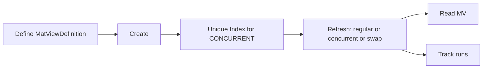

# mat_views (engine)

[](https://rubygems.org/gems/mat_views)
[](https://github.com/your-org/rails_materialized_views/actions)


Rails engine that manages **PostgreSQL materialized views** with definitions, services, background jobs, and Rake tasks.

---

## Quickstart (diagram)



---

## Install

```bash
bundle add mat_views
bin/rails g mat_views:install
bin/rails db:migrate
```

```ruby
# config/initializers/mat_views.rb
MatViews.configure do |c|
  c.job_queue = :default
end
```

---

## Define a view

```ruby
defn = MatViews::MatViewDefinition.create!(
  name: 'mv_user_activity',
  sql: <<~SQL,
    SELECT u.id AS user_id,
           COUNT(a.*) AS accounts_count,
           COUNT(e.*) AS events_count,
           COUNT(s.*) AS sessions_count
    FROM users u
    LEFT JOIN accounts a ON a.user_id = u.id
    LEFT JOIN events   e ON e.user_id = u.id
    LEFT JOIN sessions s ON s.user_id = u.id
    GROUP BY u.id
  SQL
  refresh_strategy: :concurrent,
  unique_index_columns: ['user_id']
)
```

---

## Services & Jobs

```ruby
# Create
MatViews::Services::CreateView.new(defn, force: true).run
MatViews::CreateViewJob.perform_later(defn.id, force: true)

# Refresh
MatViews::Services::RegularRefresh.new(defn, row_count_strategy: :estimated).run
MatViews::RefreshViewJob.perform_later(defn.id, row_count_strategy: :exact)

# Delete
MatViews::Services::DeleteView.new(defn, cascade: false, if_exists: true).run
MatViews::DeleteViewJob.perform_later(defn.id, cascade: true)
```

**Uniform response**: `status`, `payload`, `meta`, `success?` / `error?`.

---

## Enqueue adapter

```ruby
MatViews::Jobs::Adapter.enqueue(job_class, queue: :default, args: [...])
```

* Uses your configured backend; **no guessing**.
* Supports **ActiveJob**, **Sidekiq**, **Resque**.

---

## Rake tasks

```bash
# Create
bundle exec rake mat_views:create_by_name\[VIEW_NAME,force,--yes]
bundle exec rake mat_views:create_by_id\[ID,force,--yes]
bundle exec rake mat_views:create_all\[force,--yes]

# Refresh
bundle exec rake mat_views:refresh_by_name\[VIEW_NAME,row_count_strategy,--yes]
bundle exec rake mat_views:refresh_by_id\[ID,row_count_strategy,--yes]
bundle exec rake mat_views:refresh_all\[row_count_strategy,--yes]

# Delete
bundle exec rake mat_views:delete_by_name\[VIEW_NAME,cascade,--yes]
bundle exec rake mat_views:delete_by_id\[ID,cascade,--yes]
bundle exec rake mat_views:delete_all\[cascade,--yes]
```

---

## Docs & policies

* Root README: [../README.md](../README.md)
* **Contributing:** [../CONTRIBUTING.md](../CONTRIBUTING.md)
* **Security policy:** [../SECURITY.md](../SECURITY.md)
* **Code of Conduct:** [../CODE\_OF\_CONDUCT.md](../CODE_OF_CONDUCT.md)