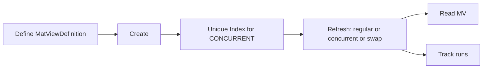

# smriti (engine)

[](https://rubygems.org/gems/smriti)
[](https://github.com/Code-Vedas/smriti/actions/workflows/ci.yml)


Rails engine that manages **PostgreSQL materialized views** with definitions, services, background jobs, and Rake tasks.

---

## Quickstart (diagram)



---

## Install

```bash
bundle add smriti
bin/rails g smriti:install
bin/rails db:migrate
```

```ruby
# config/initializers/smriti.rb
Smriti.configure do |c|
  c.job_queue = :default
end
```

---

## Define a view

```ruby
defn = Smriti::MatViewDefinition.create!(
  name: 'mv_user_activity',
  sql: <<~SQL,
    SELECT u.id AS user_id,
           COUNT(a.*) AS accounts_count,
           COUNT(e.*) AS events_count,
           COUNT(s.*) AS sessions_count
    FROM users u
    LEFT JOIN accounts a ON a.user_id = u.id
    LEFT JOIN events   e ON e.user_id = u.id
    LEFT JOIN sessions s ON s.user_id = u.id
    GROUP BY u.id
  SQL
  refresh_strategy: :concurrent,
  unique_index_columns: ['user_id']
)
```

---

## Services & Jobs

```ruby
# Create
Smriti::Services::CreateView.new(defn, force: true).call
Smriti::CreateViewJob.perform_later(defn.id, force: true)

# Refresh
Smriti::Services::RegularRefresh.new(defn, row_count_strategy: :estimated).call
Smriti::RefreshViewJob.perform_later(defn.id, row_count_strategy: :exact)

# Delete
 Smriti::Services::DeleteView.new(defn, cascade: false).call
Smriti::DeleteViewJob.perform_later(defn.id, cascade: true)
```

**Uniform response**: `status`, `meta`, `success?` / `error?`.

---

## Enqueue adapter

```ruby
Smriti::Jobs::Adapter.enqueue(job_class, queue: :default, args: [...])
```

- Uses your configured backend; **no guessing**.
- Supports **ActiveJob**, **Sidekiq**, **Resque**.

---

## Rake tasks

```bash
# Create
bundle exec rake smriti:create_by_name\[VIEW_NAME,force,row_count_strategy,--yes]
bundle exec rake smriti:create_by_id\[ID,force,row_count_strategy,--yes]
bundle exec rake smriti:create_all\[force,row_count_strategy,--yes]

# Refresh
bundle exec rake smriti:refresh_by_name\[VIEW_NAME,row_count_strategy,--yes]
bundle exec rake smriti:refresh_by_id\[ID,row_count_strategy,--yes]
bundle exec rake smriti:refresh_all\[row_count_strategy,--yes]

# Delete
bundle exec rake smriti:delete_by_name\[VIEW_NAME,cascade,row_count_strategy,--yes]
bundle exec rake smriti:delete_by_id\[ID,cascade,row_count_strategy,--yes]
bundle exec rake smriti:delete_all\[cascade,row_count_strategy,--yes]
```

---

## Rails version matrix

Use the pinned Gemfiles in `gemfiles/` to exercise the engine against specific Rails releases:

```bash
# Rails 7.2.x
bundle install --gemfile gemfiles/rails_7_2.gemfile
BUNDLE_GEMFILE=gemfiles/rails_7_2.gemfile bundle exec bin/rspec-unit
BUNDLE_GEMFILE=gemfiles/rails_7_2.gemfile bundle exec bin/rspec-e2e

# Rails 8.0.x
bundle install --gemfile gemfiles/rails_8_0.gemfile
BUNDLE_GEMFILE=gemfiles/rails_8_0.gemfile bundle exec bin/rspec-unit
BUNDLE_GEMFILE=gemfiles/rails_8_0.gemfile bundle exec bin/rspec-e2e

# Rails 8.1.x
bundle install --gemfile gemfiles/rails_8_1.gemfile
BUNDLE_GEMFILE=gemfiles/rails_8_1.gemfile bundle exec bin/rspec-unit
BUNDLE_GEMFILE=gemfiles/rails_8_1.gemfile bundle exec bin/rspec-e2e

# Rails main branch
bundle install --gemfile gemfiles/rails_edge.gemfile
BUNDLE_GEMFILE=gemfiles/rails_edge.gemfile bundle exec bin/rspec-unit
BUNDLE_GEMFILE=gemfiles/rails_edge.gemfile bundle exec bin/rspec-e2e
```

The CI workflow consumes the same Gemfiles to run the unit suite across the compatibility matrix.

---

## Screenshots

The end-to-end tests generate screenshots for visual verification. They are uploaded as artifacts in the GitHub Actions workflow runs.
After creating a pull request, apply the `e2e-screenshots` label to trigger screenshot generation.

You can trigger screenshot in your local setup as well:

```bash
# 'en' is the desired locale
SCREENSHOT_LANG=en bin/rspec-app-screenshot

# OR

# runs for all configured locales (this may take long time)
bin/rspec-app-screenshots
```

## Docs & policies

- Root README: [../README.md](../README.md)
- **Contributing:** [../CONTRIBUTING.md](../CONTRIBUTING.md)
- **Security policy:** [../SECURITY.md](../SECURITY.md)
- **Code of Conduct:** [../CODE_OF_CONDUCT.md](../CODE_OF_CONDUCT.md)
